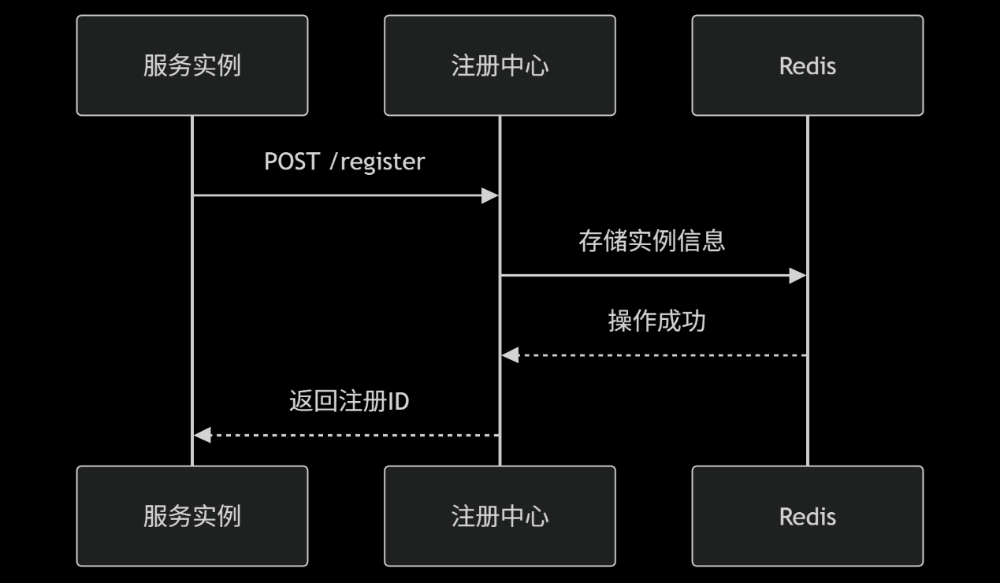
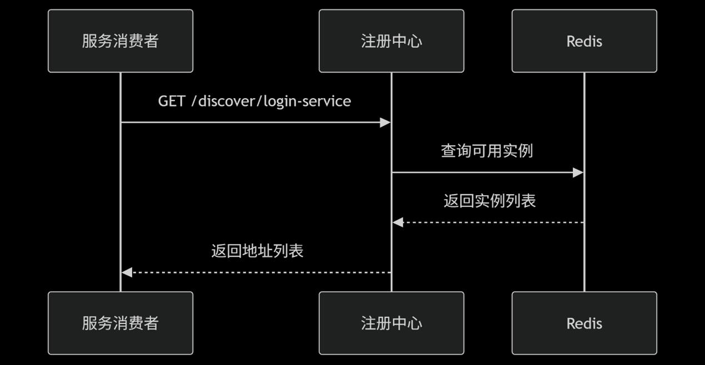
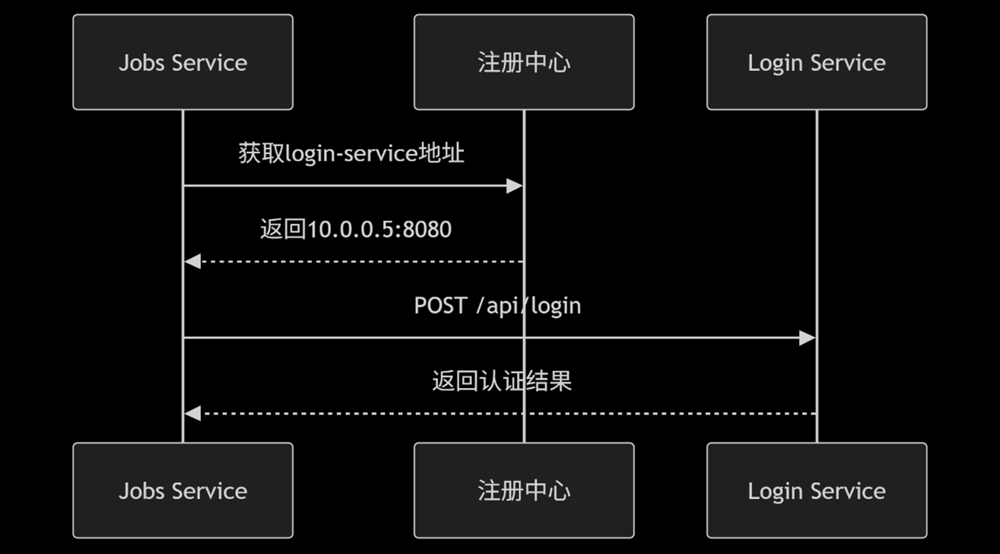
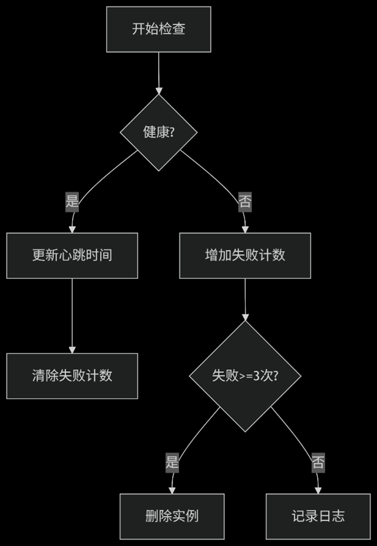
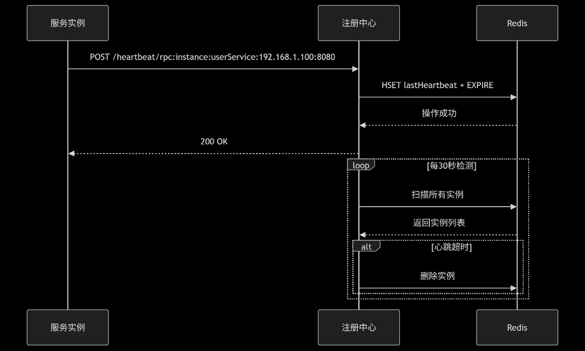

# RPC轮子项目

这是分布式计算的实验课作业，要求手搓一个RPC轮子

（需求分析）

1、设计一个rpc框架，提供一个可配的包含服务器、客户端和注册中心三种功能的远程调用服务架构的实现。

2、提供服务器自启动运行的API接口，并提供相应的配置机制

3、提供注册中心自启动运行的API接口，并提供相应的配置机制

4、提供客户端的rpc调用接口，并设计配置机制，实现一个服务既可以配置成本地调用，也可以远程调用。

======================

要求：

1、开发一个简单的WEB业务，至少包含两种不同的服务应用（至少其中一个带有参数和结果返回值）的调用。（例如：一个招聘信息查询服务，可以查询招聘岗位，可以登记招聘岗位），该业务可以直接在本地运行

2、将rpc框架打包成jar，并导入上面的web业务项目应用，并可以通过简单的配置或修改就可以将本地调用转换为远程调用。

3、系统部署至少有两台服务器分别做rpc服务和注册中心，一台pc做web业务主机。

4、rpc框架应方便调用，对原有业务的侵入要小，耦合要低，用户可以方便地将原有业务在本地调用和远程调用之间来回切换使用。

## 技术选型

注册中心采用Tomcat+Redis

客户端使用前后端分离的架构，前端使用React+Next.js+Tailwindcss，后端使用Springboot，通过Feign的方式，通过http协议调用远程服务

服务端采用Springboot

## 系统架构

本地端为Jobs Service，负责工作列表的相关业务。远程端为Login Service，负责登录相关的业务。

服务的注册架构如下：

服务的发现架构如下：

服务的调用架构如下

## 系统实现

采用RestFul风格，走HTTP协议进行交互

服务发现流程图（心跳包机制）：

# 启动流程

优先打开rpc目录，启动注册中心。然后启动login，代表远程服务模块。然后再启动jobs_server（本地后端）和jobs（本地前端）
